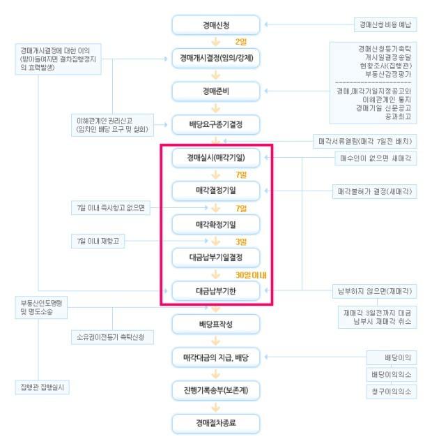
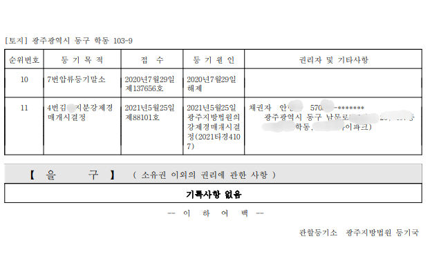
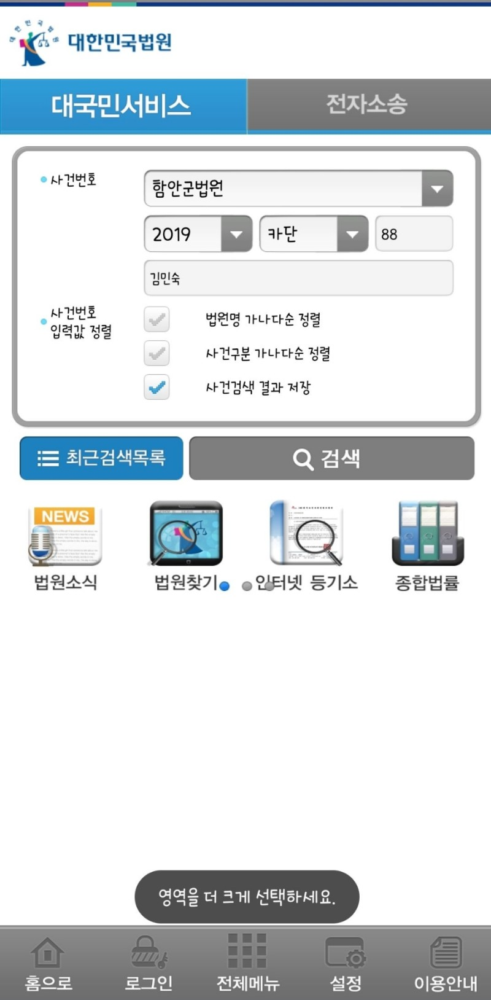
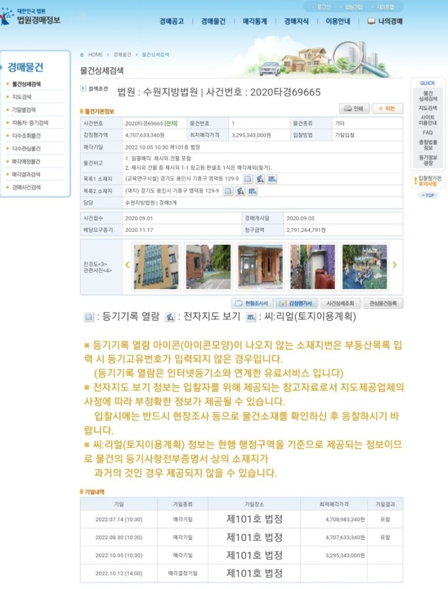
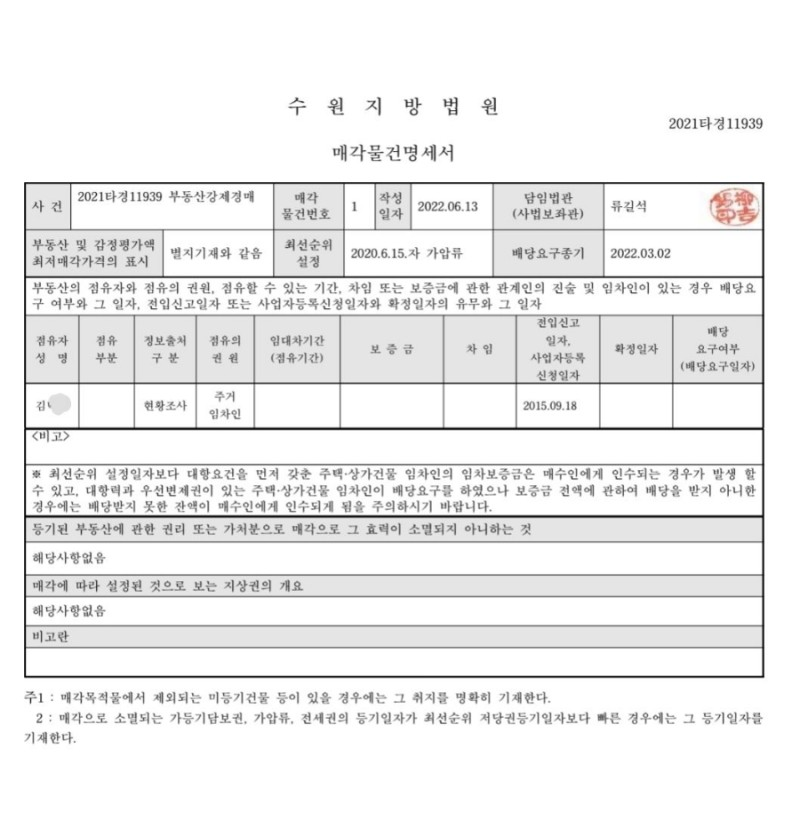
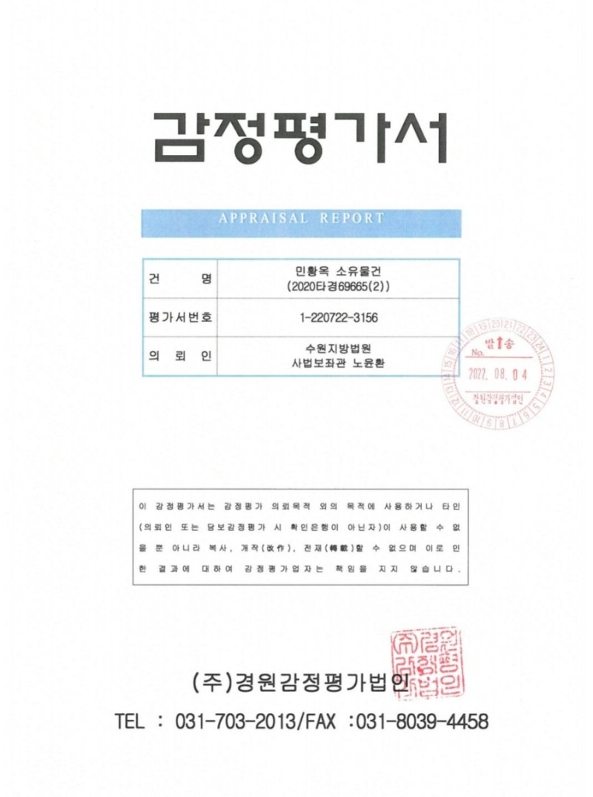
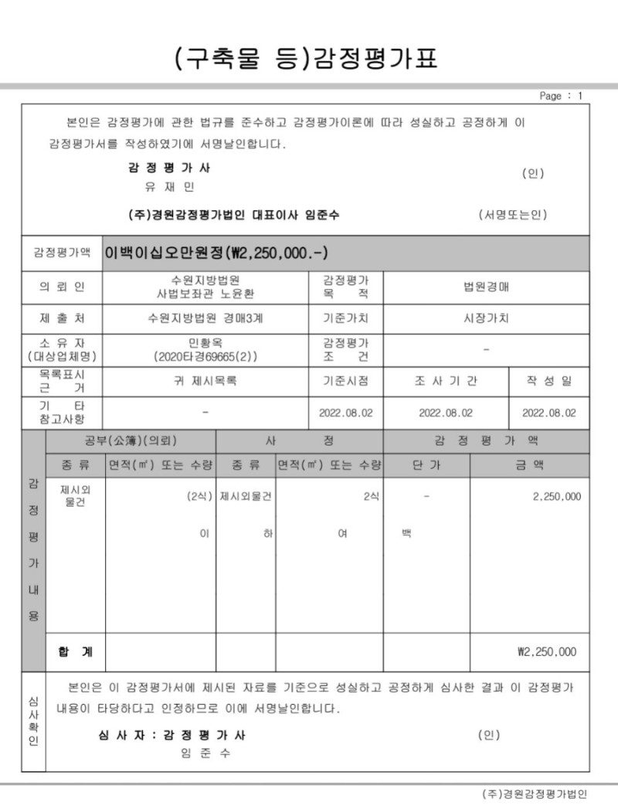
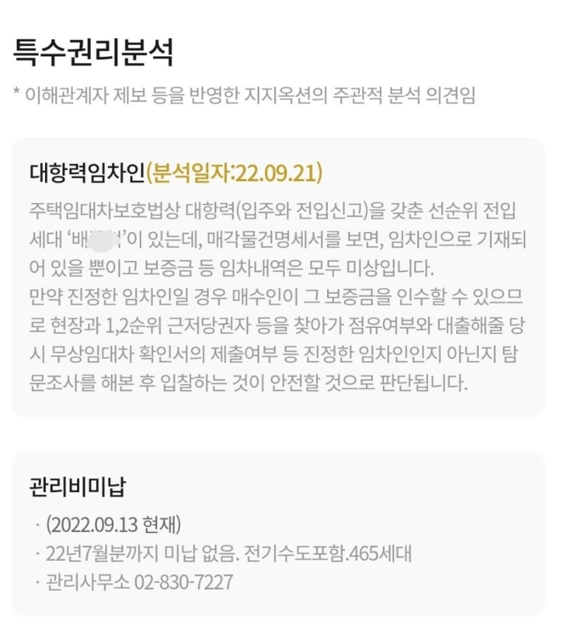
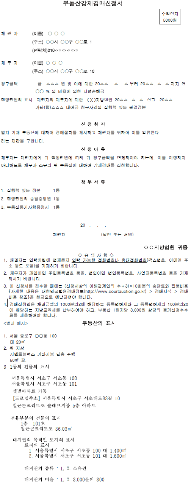
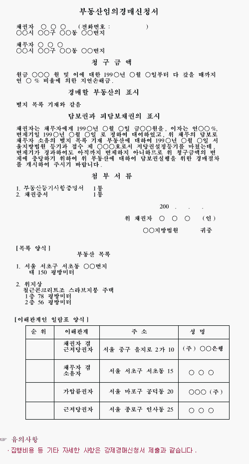

## 경매와 공매 
- 경매는 민사집행법에 따라 채권자의 요청이 있을때 채무자의 물건을 매각하여 채권자에게 돈을 돌려주는것
- 공매는 한국자산관리공사(캠코)가 주체가 되어 국세징수법에 따라 세금 미납자의 재산을 압류해 공개적으로 매각하여 채권자에게 돈을 돌려주는것
- 공매는 인터넷으로 가능해서 바쁜 직장인들이 활용하기에 좋은점이 있으나, 공개되는 정보의 양이 부족하긴 합니다. (* 유료경매 사이트들이 경매는 많은 분석자료를 제공하나 공매는 그 양이 다소 부족합니다.)

## 경매 참여 목적 
- 실거주 / 임대수익 / 단기보유 시세차익 
- 직장인이라 참여 어렵다면 가족을 이용해 대리 입찰 

## 경매에 관한 이해 관계 
- 누가 돈을 가져가는지 ? 
- 채권자들 모두 원하는 만큼 다 가져가는지?
- 돈을 주는 순서는 어떻게 되는지?
- 한푼도 못 받아서 억울한 사람을 없는지? 

특히, 세입자의 경우 억울한 보증금을 잃는 것을 방지하기 위해 최우선변제권 등 임차인 보호를 위한 제도를 제정하여 운영 

## 경매의 시작은 등기부등본

![[auction.register-copy]]

## 경매 과정 
https://www.youtube.com/watch?v=i7CW9U-yFlE

  

### 1. 경매신청​

"채권자가 채무자의 집을 경매로 처분하여 돈을 받아주세요" 라고 법원에 경매를 신청하는 과정입니다. 등기부등본 을구에 기록된 대출이라면 별도 채무관계 입증서류가 없지만, 집을 담보로 한 채무가 아닌 경우 법원의 판결문과 그것이 채무자에게 송달되었다는 송달증명원이 있어야 신청이 가능합니다.

​
### 2. 경매개시결정​

법원은 채권자의 경매신청에 대해 진행여부를 결정하고, 서류상 문제가 없다면 부동산을 압류하는 경매개시결정이 이뤄지고 이때 등기부등본에 경매개시결정이 기록됩니다. 

  

### 3. 배당요구종기결정​

채권자들에게 빚잔치를 할거니까 니들이 받을돈 얼마인지 제출하라고 하는 배당요구를 할 수 있는 기간을 정합니다. 특별한 채권자를 제외하고 모든 채권자는 배당요구종기일 내에 배당요구를 해야 나중에 돈을 받을 수 있습니다. (* 법원에서 송달되는 서류들 절대 무시하시면 안됩니다.)

### 4. 경매실시(입찰 및 낙찰)​

관할법원 경매법정에서 비공개로 최고가 매수인이 낙찰됩니다. 특정일에 경매가 진행되는것으로 공고가 되지만 채무자와 채권자의 협의에 따라 취하가 되거나, 기일이 변경되거나 하는 상황이 발생하므로, 경매법정으로 출발전 반드시 법원문건접수현황을 꼭 확인하고 출발하시고, 경매법정에 도착하시면 본인이 입찰할 물건이 실제 법원게시판에 공고되어 있는지 확인해 주셔야 합니다. 

위 사례와 같이 기일 하루전 기일변경이 되는 경우도 상당히 많습니다. 

​

최고가 매수인이 낙찰자이고, 혹시나 최고가 매수인이 잔금을 지급하지 않는 경우를 대비하여 '차순위매수신고' 제도가 있습니다. "2022타경 1234의 최고가 매수인은 홍길동입니다. 차순위매수신고 하실분 계십니까?"라고 집행관님께서 말씀하시면 해당되는 사람은 신청이 가능합니다. 차순위매수신고가 2등이라고 가능한것은 아니고, 낙찰금액에서 입찰보증금액을 뺀 금액보다 입찰가를 적어낸 사람이 자격이 있습니다.

​

예) 낙찰금액 1억, 입찰보증금 1천만원

- 이 경우 9천만원 이상 입찰가 쓰신분이 해당됩니다. 

다만, 차순위 매수신고를 하게되면 입찰보증금을 바로 돌려받지 못하고, 해당 사건이 종료될때까지 법원에 보관되는 단점이 있습니다. 1등 낙찰자가 너무 고가로 매수해서 혹시나 잔금을 납부하지 않을까 예상될때만 신청하시면 좋을 듯 합니다. 

### 5. 매각허가결정 및 잔금납부​

경매사건에 대해 절차에 하자가 없는지 이해관계자의 의견을 들어 허가 혹은 불허가 결정을 내리는 날짜를 의미합니다. 매각결정기일이 지정되면 채권자 및 채무자에게 관련내용을 통보합니다. 이후 최고가 매수인은 3~4주후에 잔금 납부가 가능합니다. 매각결정기일에 허가결정전까지는 최고가 매수인은 안심할 수 없습니다. 

​
최고가 매수인이 어떤 이유일지 몰라도 잔금 납부를 하지 않는 경우가 있습니다. 이렇게 되면 재매각 대상이 되어 다시 입찰을 진행하는데 최고가 매수인은 잔금 납부일이 지나더라도 재매각 기일 3일 전까지 지연이자 20%를 내면 소유권을 가져갈 수 있습니다. 

​
> 💡 Tip 하나​  
재매각으로 나온 물건에 대해서는 최고가 매수인이 왜 잔금을 내지 않았을까 심정을 거꾸로 이해할 수 있어야 합니다. 너무 무리해서 비싸게 낙찰 받은건지? 아니면 다른 하자가 있어 불필요한 금액을 인수해야 하는건 아닌지? 가등기가 설정된 물건을 잘못된 권리분석후 입찰에 참여했던건 아닌지? 꼼꼼히 분석해 보세요. 보통 재매각 사건은 기존 낙찰가보다 높게 낙찰되기가 쉽지 않고, 경쟁률도 낮아집니다. 보통 사람들은 하자가 있어 잔금을 납부하지 않았다고 생각하기 때문입니다. 

​
### 6. 배당​

최고가매수인이 잔금을 납부하고 4주 정도가 지나면 채권자들의 빚잔치를 위한 배당기일이 정해집니다. 경매개시결정 이후에 배당요구를 했을것이고, 배당요구한 채권자들에게 배당을 하고 경매사건은 종결됩니다. 

​

### 7. 명도​

해당 부동산에 점유중인 집주인 혹은 임차인에게 부동산을 인계 받는 절차인데 보통 경매후에 가장 어려움을 겪는 과정이 아닌가 싶습니다. 이 부분은 추후 3부에서 설명할 수 있도록 하겠습니다. ​​

​
## 경매 관련 정보 

### 대법원 경매사이트

https://www.courtauction.go.kr/

  

  

물건에 대한 기초정보와 함께 입찰자 분들이 보셔야 하는 중요 서류가 몇가지가 있습니다. 현황조사서, 매각물건명세서, 감정평가서, 등기부등본 4개는 반드시 숙지를 하셔야 하고, 매각물건명세서는 매각기일 1주일 이전부터 게시되고, 주기적으로 갱신이 되오니, 반드시 입찰전일까지 계속 확인해 주셔야 합니다. 

### 1.매각물건명세서​
가장 중요한 서류중 하나입니다. 법원이 입찰자에게 매각물건의 중요한 정보를 볼 수 있도록 그 명세서를 기록한 문서인데 특히 임차인의 권리가 기록되는 중요한 서류입니다. 2부에서 언급하겠지만 경매로 인해 소멸되는 권리와 소멸되지 않고 낙찰자에게 인수되는 권리가 기재되어 있습니다. 아래와 같은 형식입니다. 

  

### 2.현황조사서​

법원 소속의 집행관이 현장을 직접 방문하여 조사한 내용으로 부동산의 기본 정보, 부동산 현황 및 점유관계, 임대차관계 등을 표시하고 있습니다. 폐문부재로 실제 조사가 어려운 경우 '점유자 미상' 등으로 표시하기도 합니다. 

​

### 3.감정평가서​

이 부분도 매우 중요합니다. 경매공고에서는 단순히 감정가 10억 이렇게 나오는데 그것만 그대로 믿지 마시고, 감정평가를 언제한건지? 감정평가의 플러스/마이너스 요소는 무엇이 있었는지 확인해 주셔야 합니다. 예를 들어, 올해 경매에 나오는 물건들은 대부분 21년도에 감정평가가 이뤄졌고, 부동산이 상승하던 시기였기 때문에 감정평가가 지금 시세와는 상당한 차이가 있을것입니다. 추가로 부산/경남 지역에서는 감정가를 10% 정도 낮춰서 시작하는 경우도 있습니다. 감정평가를 언제 했고, 그때 시세대비 감정평가 금액의 괴리는 어떻게 되는지 꼭 확인해 주셔야 합니다. 
​

> **예) 감정평가 시점의 KB부동산시세, 실거래가격과 감정평가 금액을 서로 비교하여 고평가 감정된것인지? 저평가 된것인지를 알아야 하고, 감정평가 이후 시세의 급격한 상승 혹은 하락이 있었는지 꼭 확인해 주셔야 합니다.** 

  
  

요약장표만 화면에 표시한것으로 감정평가 기준과 방법 등이 문서에 자세히 나와 있습니다. 몇번 보시면 나중에 재개발 사업의 감정평가 기준을 익히는데 도움이 되실것으로 판단됩니다. ​​

### ​유료경매사이트가 꼭 필요한가요?

대법원 경매정보 사이트는 조회되는 정보에 제약이 있습니다. 예를 들어 등기부등본 열람시 700원을 결제해야 하는데 여러건을 조회하기에는 한계가 있습니다. 추가로 전문가들이 분석해준 권리분석 내용, 업체에서 방문조사한 내용, 추가 현장사진, 배당순위, 시세정보 등이 나와있어 경메물건 분석에 큰 도움이 되는건 사실입니다. 하지만, 년간 70~100만원 주는 비용을 주고, 유료경매사이트를 가입하는것도 부담스러운 상황입니다. 최근에는 여러명이 공유하여 시간대별로 사용하는 방식도 있으니 조금 알아보시면 저렴하게 이용하실 수 있는 방법도 있습니다. 아래는 유료경매사이트인 지지옥션의 모바일 하면 예시입니다. 

  

## 부동산 강제집행 
https://www.scourt.go.kr/nm/min_6/min_6_3/index.html 

### 강제경매
- 대상이 되는 부동산은 토지, 건물 및 그 정착물, 부동산과 동일시되는 권리가 있음
  - 부동산과 동일시되는 권리로는 공장재단, 광업재단, 광업권, 어업권, 소유권보존등기된 입목, 지상권, 자동차, 건설기계 및 항공기 등이 포함됩니다. 강제경매는 채무자가 집행권원에 따른 급부 의무를 임의로 이행하지 않는 경우에 집행문이 부여된 집행권원, 송달증명원, 부동산등기사항증명서 등을 구비하여 부동산소재지 지방법원에 경매신청을 하는 것입니다

  

### 임의경매
- 임의경매는 저당권, 질권, 전세권 등 담보물권을 설정한 후 이행기에 채무자가 이행을 하지 않을 경우 담보권실행을 위하여 부동산소재지 지방법원에 담보권을 증명하는 등기사항증명서 및 설정계약서 등을 첨부하여 경매신청을 하는 것을 말합니다. 임의경매는 집행권원이 필요하지 않으며 원칙적으로 압류에서 배당에 이르기까지 강제경매와 동일한 절차에 의합니다. 

  
